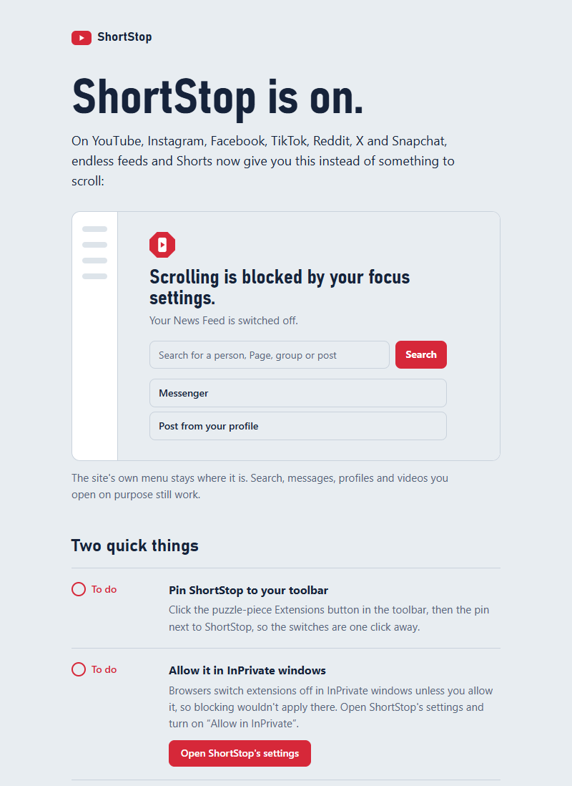
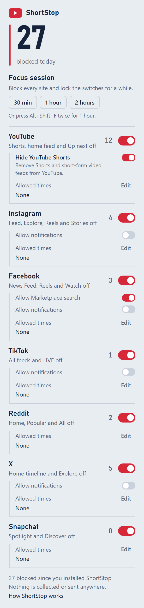

<p align="center">
  
</p>

<h1 align="center">ShortStop</h1>

<p align="center"><strong>Block Shorts, Reels &amp; Endless Feeds</strong></p>

<p align="center">
  A free, open-source browser extension that blocks short-form video and endless
  recommendation feeds on YouTube, Instagram, Facebook, TikTok, Reddit, X and Snapchat,
  while keeping the useful parts of each site working.
</p>

<p align="center">
  Chrome · Edge · Brave · Firefox (small tweak) · iPhone Safari (userscript)
</p>

<p align="center">
  <a href="https://github.com/YameenMunir/ShortStop/actions/workflows/tests.yml"></a>
  <a href="https://github.com/YameenMunir/ShortStop/actions/workflows/privacy.yml"></a>
  <a href="https://github.com/YameenMunir/ShortStop/actions/workflows/codeql.yml"></a>
</p>

---

## Contents

- [At a glance](#at-a-glance)
- [What it does](#what-it-does)
  - [Switching a site off](#switching-a-site-off)
  - [Allowed times](#allowed-times)
  - [Focus sessions](#focus-sessions)
  - [First-run welcome page](#first-run-welcome-page)
- [Privacy](#privacy)
- [Install](#install)
  - [Google Chrome](#google-chrome)
  - [Edge or Brave](#edge-or-brave)
  - [Firefox](#firefox)
  - [iPhone and iPad (Safari + the free Userscripts app)](#iphone-and-ipad-safari--the-free-userscripts-app)
- [How it works](#how-it-works)
- [When a site changes: updating selectors](#when-a-site-changes-updating-selectors)
- [Development](#development)
- [Known limitations](#known-limitations)
- [Contributing](#contributing)
- [License](#license)

## At a glance

- **Focus mode on YouTube, Instagram, Facebook, TikTok, Reddit, X and Snapchat.** Endless
  feeds, Shorts, Reels, Spotlight, Stories, LIVE and autoplay are replaced by a calm panel, so
  there's nothing to scroll.
- **Still useful.** Search, messages, profiles, groups, uploading and a video you open on
  purpose keep working, so the sites stay usable as communication tools.
- **One-click switches.** Each site's blocking turns off and back on in one click, and open
  tabs follow at once, with no reload.
- **Allowed times.** Let a site through at set times, like YouTube from 8 to 9pm on weekdays
  or Instagram at weekends. Blocking switches off and on by itself.
- **Focus sessions.** Block every site for 30 minutes, 1 hour or 2 hours, with the switches
  locked until it ends. Start one from the popup, or press **Alt+Shift+F twice** for an hour.
- **Private by design.** No data collection, no analytics, no network requests, and only
  the permissions it needs.
- **Plain JavaScript and CSS.** Chrome Manifest V3, no build step, no libraries, and 1,469
  automated checks. Built for Chrome, Edge and Brave, with a Firefox build and an iPhone
  Safari userscript.

## What it does

| Platform | What ShortStop changes |
| --- | --- |
| **YouTube** | **Focus mode.** `/shorts/VIDEO_ID` opens in the normal player (`/watch?v=VIDEO_ID`), and Shorts shelves, tabs, chips and sidebar entries are removed everywhere. The **home page's recommended grid**, Trending/Explore and Gaming are replaced by the panel (*"Scrolling is blocked by your focus settings."*), with a YouTube search box and links to Subscriptions, Watch later, Your playlists and History. On the watch page, the **"Up next"** list is hidden (the playlist panel and live chat stay), **end-screen** video walls, end cards and the "More videos" overlay are removed, and **autoplay** is switched off, with any autoplay countdown cancelled. Search results lose their "For you" / "People also watched" shelves. Search, subscriptions, playlists, channels, history and any video you open keep working, and the miniplayer keeps playing when you go back to Home. **Hide YouTube Shorts** (on by default) is its own switch, independent of the YouTube switch above it. On, Shorts shelves, cards, the Shorts tab and `/shorts/` links stay removed even while the rest of YouTube's blocking is switched off or in an allowed time. Off, Shorts are left alone, while the covered home page, Up next, end screens and autoplay keep following the YouTube switch. |
| **Instagram** | **Focus mode.** The Home feed, Explore (including hashtag, place and suggested-people pages), Reels and Stories are all blocked the same way. Their content is replaced by a ShortStop panel before it paints, so there's nothing to scroll and no way round it through the Home feed. The panel links to what still works: **Messages**, **account search**, **your profile**, and posting through Instagram's own menu. Profiles and single posts you open on purpose still work, minus the Reels tab and "Suggested for you" accounts. Reels shared in DMs are blurred and can't be opened. **Notifications** are blocked unless you turn on *Allow notifications* in the popup. |
| **Facebook** | **Focus mode.** Facebook stays a communication and utility tool, not an endless feed. The News Feed (including the Feeds filters), Reels, Watch, Stories, the groups feed and Discover, Gaming, friend suggestions and **Marketplace's recommended listings** are all blocked the same way. Each shows *"Scrolling is blocked by your focus settings."* where the feed was, with a Facebook search box and links to **Messenger**, **your profile** (to post), **your groups** and **Pages you manage**. A Watch link someone sent you gets an *Open this video only* button. Menu and top-bar shortcuts into feeds are hidden. On a blocked feed, feed keys (including Facebook's own J/K) are swallowed and videos are paused. Inside pages that stay open (profiles, a specific group, search), Reels, the Stories tray and "Suggested for you" / "People you may know" units are removed. **Marketplace:** searching and categories, listings, selling and the inbox work, and *Allow Marketplace search* in the popup can turn search off too. **Notifications** are blocked unless you turn on *Allow notifications*. |
| **TikTok** | **Focus mode.** Every algorithmic feed is blocked the same way: For You, Following, Friends, LIVE (the feed and individual streams), Explore, Short dramas (the catalog and its episodes), and the discovery pages behind hashtags, sounds, topics and channels. The feed is replaced by a panel saying *"Scrolling is blocked by your focus settings."*, so switching from For You to Following or LIVE gets you nowhere. The panel has a search box and links to **Messages**, **Upload** and **your profile**. The sidebar links into feeds are hidden. On a blocked feed, the arrow, Page Up/Down, Space and J/K keys are swallowed, and any video that starts playing is paused. **Search**, **messages**, **profiles and single videos** you open on purpose (minus "You may like" and suggested accounts), **uploading** and **account settings** keep working. **Notifications** are blocked unless you turn on *Allow notifications* in the popup. |
| **Reddit** | **Focus mode.** The **Home feed** (every sort order: Best, Hot, New, Top, Rising), **Popular**, **All**, and **Explore** and topic pages are replaced by the panel, with a Reddit search box and links to **your profile**, **saved posts** and **chat**. The Popular, All and Explore links are hidden (communities with similar names, like r/allthingsdnd, are not). A **community you open on purpose** still works, like a Facebook group, and so do **posts and comments**, **search** and **profiles**. "More posts you may like", "Popular communities" and similar boxes are removed. Works on www.reddit.com and old.reddit.com. |
| **X** | **Focus mode.** The **Home timeline** (For you and Following both live at `/home`), **Explore** with its trending tabs, and topic timelines are replaced by the panel, with an X search box and links to **Messages**, **Bookmarks** and **your profile**. The Home and Explore links are hidden, and so are "What's happening" and "Who to follow" in the right-hand column. On a blocked timeline, X's J/K and Space shortcuts are swallowed and videos are paused. **Search**, **messages**, **profiles**, **single posts**, **bookmarks** and **lists** keep working. **Notifications** are blocked unless you turn on *Allow notifications* in the popup. Works on x.com and twitter.com. |
| **Snapchat** | **Focus mode.** **Spotlight** (the feed, single Spotlight links, which play on into the next video, and a profile's Spotlight) and the **Discover** and **Explore** pages are replaced by the panel, with a link to **Snapchat for web** (chat). Links into Spotlight, Discover and Explore are hidden. Chat and public profiles keep working. |

The popup has a switch per platform, plus *Hide YouTube Shorts* under YouTube, *Allow notifications* under Instagram,
Facebook, TikTok and X, *Allow Marketplace search* under Facebook, and *Allowed times* under each.
Changes apply to open tabs straight away, without a reload. It also shows how many
Shorts, Reels and feeds were blocked today (visiting a blocked feed page counts once).

### Switching a site off

Each site's switch turns off **in one click**: blocking stops in every open tab straight away,
with no choice, countdown or confirmation, and clicking it again turns blocking back on at
once. *Hide YouTube Shorts* keeps its own setting either way.

### Allowed times

Under each platform, **Allowed times** lets it through at set times, for example YouTube from
20:00 to 21:00 on weekdays, or Instagram all day at weekends. Each platform can have up to 3
times. Pick the days, then a start and end time:

- The same start and end time means **all day**, and an end time earlier than the start runs
  **past midnight** (Friday 23:00 to 01:00 ends early on Saturday).
- Inside an allowed time, blocking switches off by itself in every open tab, and it comes back
  on by itself when the time ends. Times follow the clock of the device you're on.
- **Adding or lengthening** a time takes a 30-second wait and a confirmation, so you can't
  open up a site on impulse. **Shortening or removing** one is saved
  straight away.
- **Block now** during an allowed time blocks the site again until that time ends (or until
  midnight, if the site is allowed all week).

Allowed times are saved with your other settings, so they follow your browser profile.

### Focus sessions

The switches turn off in one click, so nothing stops you switching a site off on impulse.
When you want that, start a **focus session** from the top of the popup: pick **30 min**,
**1 hour** or **2 hours**, then **Start**.

- Until it ends, **every site is blocked**: its switch, its allowed times and *Hide YouTube
  Shorts* are overridden, and they're locked in the popup (the switches show on and can't be
  clicked, and allowed times can't be edited). The smaller options such as *Allow
  notifications* still work.
- The popup shows how long is left and when it ends. It **can't be stopped early**, which is
  the point, so the length is confirmed before it starts.
- When it ends, every site goes back to its own settings by itself, in open tabs too.
- **Keyboard shortcut:** press **Alt+Shift+F twice** to start a 1-hour session without opening
  the popup. The first press shows **1h?** on ShortStop's toolbar icon for 5 seconds, so a
  stray key press can't lock you out; the second press starts it, and the icon briefly shows
  **60m**. Pressing it during a session shows the minutes left. Change the shortcut at
  `chrome://extensions/shortcuts` (the popup shows the one in use). It needs no extra
  permission.
- It's saved with your other settings (as the time it ends), so a session covers every
  computer on your browser profile.

### First-run welcome page

The first time ShortStop is installed, it opens a welcome page in a new tab. It shows what a
blocked page looks like and walks through the two setup steps a browser won't do for you:

- **Pin the toolbar icon**, so the switches are one click away. The page reads whether the
  icon is pinned and shows a tick once it is.
- **Allow it in private windows.** Browsers switch extensions off in private/incognito windows
  unless you opt in, so blocking wouldn't apply there. The page shows whether it's allowed,
  names your browser's own setting ("Allow in Incognito", "Allow in InPrivate"), and has a
  button that opens ShortStop's settings page.

Both steps update by themselves while the page is open, with no refresh. Where a browser can't
report the state, the step says so and shows the manual instructions instead. Below the checklist,
a short **Good to know** list sums up the one-click switches, allowed times, focus sessions and the
keyboard shortcut. The page only opens on a fresh install (not on updates), and you can reopen it
any time from **How ShortStop works** at the bottom of the popup. It needs no extra permission and
makes no network requests.

<p align="center">
  
</p>

<p align="center">
  
</p>

## Privacy

- **No data collection, no analytics, no network requests.** The extension never
  calls `fetch`, loads no remote code and uses no third-party libraries. A
  [privacy guard](tools/check_privacy.py) checks this automatically on every change.
- **Minimum permissions:** `storage`, plus host access to the seven sites it works on
  (YouTube, Instagram, Facebook, TikTok, Reddit, X and Snapchat). It can't see any other
  website.
- Your platform switches, options, allowed times and a running focus session's end time are
  saved with `chrome.storage.sync`, so they follow your browser profile. The daily counter, a
  waiting change to the allowed times and any *Block now* live in `chrome.storage.local`, on
  your device only.

## Install

### Google Chrome

ShortStop isn't on the Chrome Web Store, so you add it to Chrome yourself with **Load unpacked**.
It takes about a minute.

1. **Get the files.** Either:
   - download `ShortStop-<version>-chromium.zip` from the
     [latest release](../../releases/latest) and unzip it. You get a folder called
     `ShortStop`. Or:
   - on this page, click **Code → Download ZIP**, unzip it, and use the `extension` folder
     inside. (If you cloned the repo, use its `extension` folder.)

   Put the folder somewhere it can stay, such as `Documents`. Chrome loads ShortStop from it
   every time it starts, so don't delete or move it afterwards.
2. In Chrome, open `chrome://extensions` (or **⋮ menu → Extensions → Manage Extensions**).
3. Turn on **Developer mode** (the switch in the top right corner).
4. Click **Load unpacked** and select the folder from step 1: the one with `manifest.json`
   directly inside it.
5. ShortStop appears in your list of extensions, and its welcome page opens in a new tab.
   Follow it to **pin** ShortStop to the toolbar (the puzzle-piece icon, then the pin next to
   ShortStop), so its switches are one click away.
6. Optional: to block in Incognito windows too, click **Details** on ShortStop's card and turn
   on **Allow in Incognito**.

That's it: open YouTube, Instagram or any of the other sites to see it working.

**Updating:** replace the folder's contents with the new version (or `git pull` in your clone),
then click the ↻ reload icon on ShortStop's card in `chrome://extensions`. Your settings are
kept. Tabs showing the ShortStop panel refresh themselves; refresh any other open tabs on the
blocked sites.

**If it doesn't load:** "Manifest file is missing or unreadable" means the folder you picked is
one level too high or too low. Choose the folder that has `manifest.json` directly inside it.

**Removing:** click **Remove** on ShortStop's card in `chrome://extensions`.

Requires Chrome 111 or newer.

### Edge or Brave

The same steps work, on each browser's own extensions page: `edge://extensions` or
`brave://extensions`. In Edge, **Developer mode** is in the left sidebar. Requires Edge or
Brave 111 or newer.

### Firefox

Firefox runs Manifest V3 slightly differently, so there is a separate build:

1. Download `ShortStop-<version>-firefox.zip` from the [latest release](../../releases/latest)
   (or build it with `python tools/package.py`).
2. Open `about:debugging#/runtime/this-firefox`, click **Load Temporary Add-on…**
   and pick the Firefox zip (or `manifest.json` inside the unzipped folder).
3. Open `about:addons` → ShortStop → **Permissions** and allow access to the sites.
   Firefox treats MV3 host permissions as opt-in.

What the Firefox build changes, and why:

| Change | Reason |
| --- | --- |
| `background.scripts` instead of `background.service_worker` | Firefox MV3 uses event pages, not service workers. `background.js` already handles both. |
| `browser_specific_settings.gecko.id` | Firefox needs a stable add-on ID. |
| `strict_min_version: 128.0` | Content scripts with `"world": "MAIN"` (the pushState hook) need Firefox 128+. `:has()` needs 121+. |
| `data_collection_permissions: { required: ["none"] }` | This is how you declare "no data collection" to addons.mozilla.org. |

Temporary add-ons are removed when Firefox restarts. To keep it installed, sign it
(free) through addons.mozilla.org.

### iPhone and iPad (Safari + the free Userscripts app)

iOS Safari extensions can't be side-loaded, so ShortStop also ships as a single
userscript: [`userscript/shortstop.user.js`](userscript/shortstop.user.js), with the same
focus modes for YouTube, Instagram, Facebook, TikTok, Reddit, X and Snapchat.

1. Install **Userscripts** (by Justin Wasack, free) from the App Store.
2. Open the Userscripts app and choose a folder for your scripts, for example
   `iCloud Drive/Userscripts`.
3. Turn the extension on: **Settings → Apps → Safari → Extensions → Userscripts**.
   Enable it and set **youtube.com, instagram.com, facebook.com, tiktok.com, reddit.com, x.com,
   twitter.com and snapchat.com** (or All Websites) to **Allow**.
   On older iOS versions this is under **Settings → Safari → Extensions**.
4. Put `shortstop.user.js` in that folder. Either:
   - open the raw file on GitHub in Safari, tap the **Userscripts** icon in the address
     bar menu and choose **Install**, or
   - download it and move it into the folder with the Files app.
5. Visit m.youtube.com. The Userscripts menu should show ShortStop as active.

**Changing settings on iPhone:** edit the constants at the very top of the file, then save:

```js
const BLOCK_YOUTUBE_SHORTS = true;              // Shorts, home feed, Up next, autoplay
const HIDE_YOUTUBE_SHORTS = true;               // false: leave Shorts alone, keep the rest

const BLOCK_INSTAGRAM_REELS = true;             // Home feed, Explore, Reels, Stories
const ALLOW_INSTAGRAM_NOTIFICATIONS = false;

const BLOCK_FACEBOOK_FEEDS = true;              // News Feed, Reels, Watch, Stories, Marketplace browsing
const ALLOW_FACEBOOK_NOTIFICATIONS = false;
const ALLOW_FACEBOOK_MARKETPLACE_SEARCH = true;

const BLOCK_TIKTOK_FEEDS = true;                // For You, Following, Friends, LIVE, Explore
const ALLOW_TIKTOK_NOTIFICATIONS = false;

const BLOCK_REDDIT_FEEDS = true;                // Home, Popular, All, Explore

const BLOCK_X_FEEDS = true;                     // Home timeline, Explore
const ALLOW_X_NOTIFICATIONS = false;

const BLOCK_SNAPCHAT_SPOTLIGHT = true;          // Spotlight, Discover, Explore
```

The userscript has no popup, daily counter, allowed times, focus sessions or keyboard shortcut,
because Safari userscripts have no shared storage. To switch a platform off, set its constant to
`false`, and back to `true` later.

## How it works

```
extension/
├── manifest.json            MV3 manifest: storage + the seven sites, and the Alt+Shift+F command
├── background.js            Service worker: the daily counter (one write queue for all tabs), the
│                            Alt+Shift+F focus-session shortcut, and the welcome page on first install
├── shared/stats.js          Counter helpers shared by the background worker and popup
├── shared/pause.js          The 30-second wait before loosening allowed times, shared by popup and welcome page
├── shared/schedule.js       Allowed times: is a platform allowed now, until when, and is a change looser
├── content/
│   ├── core.js              The engine: CSS generation, MutationObserver, SPA navigation, redirects
│   ├── nav-hook.js          Runs in the page's own JS world; wraps history.pushState/replaceState
│   ├── youtube.js           YouTube focus mode: Shorts redirects, covered home feed, autoplay effects
│   ├── instagram.js         Instagram focus mode: covered routes, selectors, redirects
│   ├── facebook.js          Facebook focus mode: covered feeds, Marketplace rules, selectors
│   ├── tiktok.js            TikTok focus mode: covered feeds, panel search, selectors
│   ├── reddit.js            Reddit focus mode: Home, Popular, All and Explore covered
│   ├── x.js                 X focus mode: Home timeline and Explore covered, sidebar trends
│   └── snapchat.js          Snapchat focus mode: Spotlight, Discover and Explore covered
├── popup/                   Focus sessions, platform switches, options, allowed times and today's counter
├── welcome/                 First-run page: the panel explained, pin and private-window checklist
└── icons/                   16, 32, 48 and 128 px PNGs
userscript/shortstop.user.js Generated from content/*.js for iOS Safari
tools/                       Python helpers, no dependencies: icons, userscript builder, zip packager,
                             and the privacy guard, README-count and version checks
tests/                       Fixture pages, a test harness, a headless-browser runner, privacy-guard tests
.github/                     Workflows (tests, privacy guard, CodeQL, releases) and Dependabot
docs/                        Screenshots used in this README
TESTING.md                   Manual checklist to run on real accounts
CLAUDE.md                    Notes for Claude Code, including the one-branch-per-change rule
```

Each platform file is a single config object, and `core.js` does the work:

1. **No flash of Shorts.** At `document_start`, before the site paints anything,
   the engine turns every rule into a CSS rule and injects it. Rules that only apply
   on one page (like Instagram Explore) are scoped with a `data-shortstop-page`
   attribute on `<html>`.
2. **Dynamic content.** A `MutationObserver` re-scans as the site streams in more
   content, throttled to one scan per 120 ms. Matches get a `data-shortstop-hidden` or
   `data-shortstop-blurred` attribute, which is what the daily counter counts. It also
   handles rules CSS can't express, such as "a chip whose text is exactly *Shorts*". Items
   YouTube recycles for a different video are un-hidden automatically.
3. **SPA navigation.** These sites change pages without reloading. The engine listens
   for a `pushState`/`replaceState` hook (`nav-hook.js`), YouTube's `yt-navigate-finish`,
   `popstate`, and a one-second URL check as a safety net. It also catches clicks on
   Short/Reel links before the site's router plays them.
4. **Covered routes.** A config can list whole routes to cover: every feed on each of the
   seven sites. A route is a pathname pattern, or a test on the whole URL
   when the site keeps the feed choice in the query string. On those routes the content area
   (`main`, Facebook's `div[role="main"]`, TikTok's `div#main-content-…`, YouTube's
   `ytd-browse`) is hidden by the same `document_start` stylesheet, and a ShortStop panel takes
   its place.
   - The panel is built in a shadow root, so the site's CSS can't touch it. It can carry a
     search box and links that differ per page (Marketplace search, "Open this video only").
   - While a feed is covered, feed keys are swallowed (except when typing) and any media that
     starts playing is paused. A platform can opt out of either: YouTube does, so its
     miniplayer keeps playing and working.
   - The route is re-checked on every navigation and DOM change, so the panel comes back if
     the site re-renders it away. If there is no content area (still loading, or after a
     redesign), the panel covers the whole viewport and locks scrolling instead.
5. **Effects.** Some things can't be hidden, only changed: YouTube's autoplay is switched off
   through its own toggle, and a running autoplay countdown is cancelled. Effects run after
   every scan and are safe to repeat.
6. **Live settings.** Content scripts listen to `chrome.storage.onChanged`. Switching a
   platform or option off removes the stylesheet, un-hides everything and removes the panel,
   and switching it on re-applies everything. No reload needed. Allowed times
   (`shared/schedule.js`, loaded before `core.js`) are checked once a second, and the
   settings are re-applied whenever an allowed time starts or ends. A **focus session** is
   just an end time (`focusUntil`) in the synced settings, and the engine treats it as the
   strongest rule: while it runs, every platform blocks whatever its switch, allowed times or
   options say. The popup starts one and locks its controls, and `background.js` starts one from
   the keyboard shortcut (first press arms it and shows **1h?** on the icon, second press within
   5 seconds starts it), so the shortcut works without opening the popup.
   When ShortStop is reloaded or updated, the copy already running in open tabs is cut off
   and can no longer hear the popup, and browsers don't give those tabs the new copy. The
   one-second check notices, and a tab showing only the ShortStop panel refreshes itself, so
   switches work there straight away. Tabs showing a video or other content are never
   refreshed under you; they pick up the new copy on their next blocked page or refresh.

## When a site changes: updating selectors

All seven sites change their markup regularly. When something slips through, the fix is
usually one line in one file.

1. **Find the element.** Right-click the Short, Reel or recommendation that got through →
   **Inspect**. Walk up the DOM to the element that wraps the whole thing (the shelf, card or
   list item).
2. **Pick a stable selector.** In order of preference:
   - a custom element name: `ytd-reel-shelf-renderer`
   - an attribute: `[is-shorts]`, `[tab-title="Shorts"]`, `[role="tab"]`
   - a URL pattern: `a[href^="/shorts/"]`, `a[href*="/reel/"]`
   - `:has()` to target a container by what's inside it:
     `ytd-rich-item-renderer:has(a[href^="/shorts/"])`
   - a test attribute the site uses for its own testing, such as TikTok's
     `[data-e2e="nav-foryou"]` (these change far less than class names)
   - ARIA labels (`[aria-label="Reels"]`) work, but depend on the site's language

   Avoid generated class names like `.x1lliihq` or `.style-scope-abc123`. They change with every deploy.
3. **Test it in the Console first.** Paste the selector and make sure it matches only what you want:
   ```js
   document.querySelectorAll('ytd-rich-item-renderer:has(a[href^="/shorts/"])')
   ```
4. **Add a rule** to the platform's config in `extension/content/<platform>.js`:
   ```js
   {
     name: 'Shorts carousel on the watch page',   // shows up in console warnings
     selector: 'ytd-reel-shelf-renderer',
     count: true,                                 // counts toward "blocked today"
   },
   ```
   Options: `page: 'explore'` scopes the rule to a named page, `action: 'blur'` blurs
   instead of hiding, `closest: 'div[role="button"]'` hides an ancestor of the match,
   `text: /^Shorts$/` requires the matched element's text to match, and
   `onlyIf: (options) => !options.notifications` ties the rule to a popup option.

   **To block a whole route instead**, add a pattern to `pages` (a pathname RegExp, or a
   function of the URL) and list that name under `cover.pages` with a message. A page can
   override the panel's `search` and `links`. If the site stops using the same content area,
   update `cover.target` (a list of selectors, first match wins). `cover.pauseMedia` and
   `cover.blockKeys` can be set to `false` where a site needs its own playback and keys.
   For something that has to be *done* rather than hidden, add an entry to `effects`.
   Put container rules (shelves, sections) **above** item rules so items inside them aren't
   counted twice.
5. **Reload the extension** (the ↻ button on `chrome://extensions`), then refresh the site.
6. **Rebuild the userscript** so iPhone gets the same fix:
   `python tools/build_userscript.py`
7. **Run the tests**, and add the new markup to `tests/fixtures/<platform>.html`
   with `data-expect="hidden"` so it stays fixed:
   `python tests/run_tests.py`

If a selector is invalid, the engine logs `[ShortStop] Invalid selector in rule "…"`
once and carries on with the other rules.

## Development

All tooling is Python 3 standard library, with no `pip install` needed.

```bash
python tests/run_tests.py          # 1,469 checks in headless Chrome/Edge against mock site markup
python tools/build_userscript.py   # regenerate userscript/shortstop.user.js from extension/content/
python tools/make_icons.py         # regenerate extension/icons/*.png
python tools/package.py            # build dist/ShortStop-<version>-{chromium,firefox}.zip
```

**Automatic checks.** [GitHub Actions](.github/workflows/tests.yml) runs on every pull request
(including from forks), every push to `main`, and on demand from the **Actions** tab. It fails
if the userscript wasn't rebuilt after a change, if any test fails, or if this README states the
wrong number of checks (`python tools/check_readme_count.py <test output>` checks that locally).

The **privacy guard** ([workflow](.github/workflows/privacy.yml)) runs alongside it and fails any
change that breaks the privacy promise:

- a network call anywhere in the extension or the userscript: `fetch`, `XMLHttpRequest`,
  `WebSocket`, `EventSource`, `sendBeacon`, WebRTC or WebTransport
- remote code or resources: `importScripts`/`import` from a URL, `eval`, `new Function`, remote
  `<script>`, `<link>`, `` or `<iframe>` sources, a `.src` set to a URL, and `url(https://…)`
  or `@import` in CSS
- `manifest.json` asking for more than `storage` and the supported sites, or adding optional
  permissions, `externally_connectable`, `update_url` or a custom `content_security_policy`

Ordinary links (`<a href="https://…">`) are fine. Run it locally with
`python tools/check_privacy.py`; its own tests are in `tests/test_privacy_guard.py`. Adding a
supported site is deliberate: add its patterns to `ALLOWED_HOSTS` in the guard in the same pull
request as `manifest.json`.

**Code scanning.** [CodeQL](.github/workflows/codeql.yml), GitHub's free security analysis, checks
the extension's JavaScript and these workflow files on every pull request, on every push to
`main` and once a week, using GitHub's `security-extended` rules. It looks for problems such as
injection or unsafe DOM use, and for risky workflow settings. Findings appear on the pull request
and in the repository's **Security** tab. It skips `tests/` and the generated userscript
([config](.github/codeql/codeql-config.yml)).

**Keeping the workflows up to date.** [Dependabot](.github/dependabot.yml) checks the actions the
workflows use (`actions/checkout`, `actions/setup-python`, `github/codeql-action`) every Monday,
and opens one pull request with any new versions. The usual checks run on it, so it's safe to
merge once they pass. ShortStop itself has no dependencies, so there's nothing else to update.

**Releasing.** Pushing a tag like `v1.1.0` runs the [release workflow](.github/workflows/release.yml).
It checks the tag matches the version, runs the privacy guard and the full test suite, builds
the Chrome and Firefox zips with `tools/package.py`, and publishes a
[GitHub Release](../../releases) with both zips and the iPhone userscript attached. To release:

1. Set the new version in `extension/manifest.json` and in `version: '…'` in
   `extension/content/core.js`, then run `python tools/build_userscript.py` (it copies the
   version into the userscript). `python tools/check_version.py` confirms all three agree.
2. Merge that into `main`.
3. Tag it and push the tag: `git tag v1.1.0 && git push origin v1.1.0`.

If a release goes wrong, fix it on `main`, then re-run the workflow from the **Actions** tab or
move the tag; re-running replaces the release's files rather than failing.

The test fixtures in `tests/fixtures/` mimic each site's markup. `tests/harness.js`
runs the real engine against them with a fake URL and in-memory settings. For each
platform it checks:

- what is hidden and what stays visible, including content added later (infinite scroll)
- recycled YouTube items reappearing when they become a normal video
- the counter total, with no double counting
- switching off and back on
- page-scoped rules (Explore, DMs)
- covered routes on every platform: the panel's title, message, links and search box,
  the panel re-mounting after the site removes it, the full-viewport fallback, and the
  notification options
- feed keys being swallowed (but not while typing), media being paused, and the panel's
  search box going to the right results page
- switching off and on at once, and ignoring a pause left behind by the retired pause flow
- Allowed times on every platform: blocking is lifted inside one, ignores another day's,
  another platform's or a malformed one, respects *Block now*, and (with a fake clock)
  switches off and back on by itself when an allowed time starts and ends
- Focus sessions on every platform: blocking while switched off or inside an allowed time,
  ending by itself on time, and (YouTube) hiding Shorts even with *Hide YouTube Shorts* off
- Facebook Marketplace: home and city browsing blocked; search, categories, listings and
  selling allowed; everything but listings and selling blocked when search is switched off
- YouTube: Up next hidden while the playlist panel and live chat stay, end screens removed,
  the autoplay toggle switched off exactly once, the countdown cancelled, and the
  miniplayer left playing on the covered home page
- every redirect rule
- redirects triggered by SPA navigation

Three more pages have no site markup. `schedule.html` unit-tests
[shared/schedule.js](extension/shared/schedule.js): weekday, all-day and past-midnight times,
back-to-back times, bad data, and which edits count as looser. `popup.html` loads the real
popup with an in-memory `chrome.storage` and clicks through it: leftovers from the retired
pause flow being tidied away, every switch turning off and back on in one click, *Hide YouTube
Shorts*, adding a time (waits), shortening and removing one (instant), a time with no days,
*Block now*, and a focus session starting, locking everything and unlocking by itself.
`background.html` loads the real [background.js](extension/background.js) with a fake `chrome`
API and "presses" the keyboard shortcut: the first press only shows **1h?** and clears after 5
seconds, a second press starts the hour and shows **60m**, a press during a session shows the
minutes left without extending it, and any other command does nothing. It can't test that a
real browser assigns the key, which depends on your browser (see the limitations below).

A manual checklist for real accounts is in [TESTING.md](TESTING.md).

## Known limitations

- **Testing coverage.** The engine is tested against mock pages for every platform, and
  YouTube and TikTok were also checked on the live sites (signed out) in Edge. Instagram and
  Facebook need a signed-in account, so run their sections of [TESTING.md](TESTING.md) on real
  accounts. The Firefox build and the iPhone userscript haven't been run on a real Firefox or
  iPhone yet, so treat them as untested.
- **This isn't a lock.** Switches turn off in one click, except during a focus session. The
  30-second wait only applies to adding or lengthening allowed times, and someone determined can
  still change settings in the browser's developer tools or uninstall the extension, even
  during a focus session.
- Allowed times follow each device's own clock and time zone.
- **The Alt+Shift+F shortcut isn't guaranteed.** A browser leaves a suggested shortcut unset when
  another extension already uses it. The popup only shows its "press … twice" line when a
  shortcut is assigned, so if that line is missing, set one at `chrome://extensions/shortcuts`
  (or `edge://` / `brave://`). It only works while the browser window has focus (not another app
  such as a code editor), and the **1h?** badge appears on ShortStop's toolbar icon, so pin the
  icon to see it. Alt+Shift may also clash with Windows' keyboard-layout switching if you have
  several input languages; if it does, choose another combination.
- **Private windows.** Browsers don't run extensions in private/incognito windows unless you
  allow it under the extension's details, so blocking doesn't apply there by default.
- The smaller options (*Hide YouTube Shorts*, *Allow notifications*, *Allow Marketplace
  search*) switch instantly too. *Hide YouTube Shorts* is independent of the YouTube switch:
  switching YouTube off or an allowed time lifts the
  rest of YouTube's blocking but keeps Shorts hidden. Switch *Hide YouTube Shorts* off to see
  them.
- YouTube's "For you" / "People also watched" shelves in search are matched by their English
  titles, and the m.youtube.com "related videos" rule hasn't been checked on a phone.
- Instagram and Facebook selectors that use ARIA labels (the DM Reel badge, the
  "Reels and short videos" carousel) match English labels. URL-based rules work in
  any language.
- On Facebook, a post inside a group or profile is hidden if it links to a Reel,
  including a Reel shared in a normal post.
- Facebook's "Suggested for you" and "People you may know" units are found by their
  English headings. The feeds themselves are blocked by URL, which works in any language.
- *Open this video only* uses Facebook's `video.php?v=` link. If Facebook sends that
  back to Watch, you get the Watch panel again (no redirect loop).
- Instagram's desktop Search opens as a side panel from its own sidebar, which stays
  available. The panel's "Search for an account" link goes to `/explore/search/`, the
  search page Instagram uses on phones.
- Instagram profile grids stay visible so you can look at an account on purpose. Opening a
  Reel from one shows the "Reels are off" panel.
- The "Suggested for you" block on profiles is found by its English heading.
- TikTok's "You may like" and similar recommendation sections on profiles and video pages
  are found by their English headings. The sidebar's suggested accounts use TikTok's
  `data-e2e` attribute and work in any language.
- TikTok shows a "Short drama" feed to some users. `/shortdrama` and its episodes
  (`/shortdrama/episode/…`) are covered, but that URL pattern comes from public reports rather
  than a live check, because the feed wasn't shown to the test account.
- m.facebook.com uses a different layout. Its feeds are still blocked by URL, with the
  panel covering the whole screen.
- **Reddit, X and Snapchat are new and haven't been checked on the live sites yet.** Their
  feeds are blocked by URL, which is the dependable part. The selectors for links,
  sidebars and recommendation boxes come from their known markup and are tested against
  mock pages only, so run their sections of [TESTING.md](TESTING.md) and adjust
  `extension/content/<site>.js` where something slips through.
- Reddit keeps communities you open on purpose, so a community's own post list can still be
  scrolled, just as a Facebook group can. Reddit's "More posts you may like", "Popular
  communities" and similar boxes, and X's right-hand-column boxes other than "Who to
  follow" and trends, are found by their English headings.
- On X, the "Discover more" posts under a post's replies aren't removed yet.
- Snapchat's web markup has no reliable content area, so on Spotlight the panel may cover
  the whole window rather than just the feed.
- Adding sites means new host permissions. A store-installed copy would ask you to approve
  them on update; a loaded-unpacked copy just needs reloading.

## Contributing

Have an idea for a feature? You don't need to ask first. Build it and send it in:

1. **Fork** this repository (the **Fork** button at the top of the page).
2. Make your change on a new branch in your fork, one branch per feature or fix, named for what
   it does (`feature/…`, `improvement/…`, `fix/…` or `docs/…`). If it changes what gets
   blocked, add the new markup to `tests/fixtures/<platform>.html` (see
   [When a site changes](#when-a-site-changes-updating-selectors)).
3. Run `python tests/run_tests.py` and `python tools/build_userscript.py`. The same checks run
   automatically on your pull request, and it shows whether they passed.
4. Open a **pull request** that says what your idea is and why you'd want it.

Every feature idea is welcome, and a pull request is the place to suggest one. I'll test it and
think it over, and if it fits, I may add it to the main code. The one thing I can't accept is a
change that breaks ShortStop's privacy promise: no data collection, no analytics, no network
requests, and no permissions beyond the supported sites. The **privacy guard** check on your pull
request tells you straight away if something does (see [Development](#development)).

## License

Released under the [MIT License](LICENSE). You're free to use, copy, modify and
distribute it, as long as you include the copyright and license notice.

**Taking the code and passing it off as your own doesn't work.** The MIT License lets you learn
from ShortStop, fork it and build on it, but every copy, and every project built from it, must
keep the copyright notice naming Yameen Munir. Removing that notice, or claiming you wrote the
code, breaks the license. Please also don't publish your copy under the ShortStop name or as the
official version.

```
MIT License

Copyright (c) 2026 Yameen Munir

Permission is hereby granted, free of charge, to any person obtaining a copy
of this software and associated documentation files (the "Software"), to deal
in the Software without restriction, including without limitation the rights
to use, copy, modify, merge, publish, distribute, sublicense, and/or sell
copies of the Software, and to permit persons to whom the Software is
furnished to do so, subject to the following conditions:

The above copyright notice and this permission notice shall be included in all
copies or substantial portions of the Software.

THE SOFTWARE IS PROVIDED "AS IS", WITHOUT WARRANTY OF ANY KIND, EXPRESS OR
IMPLIED, INCLUDING BUT NOT LIMITED TO THE WARRANTIES OF MERCHANTABILITY,
FITNESS FOR A PARTICULAR PURPOSE AND NONINFRINGEMENT. IN NO EVENT SHALL THE
AUTHORS OR COPYRIGHT HOLDERS BE LIABLE FOR ANY CLAIM, DAMAGES OR OTHER
LIABILITY, WHETHER IN AN ACTION OF CONTRACT, TORT OR OTHERWISE, ARISING FROM,
OUT OF OR IN CONNECTION WITH THE SOFTWARE OR THE USE OR OTHER DEALINGS IN THE
SOFTWARE.
```

ShortStop isn't affiliated with or endorsed by YouTube, Google, Instagram, Facebook,
Meta, TikTok, Reddit, X or Snap.
